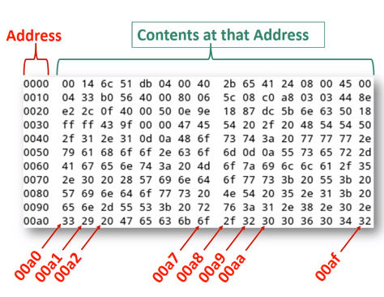
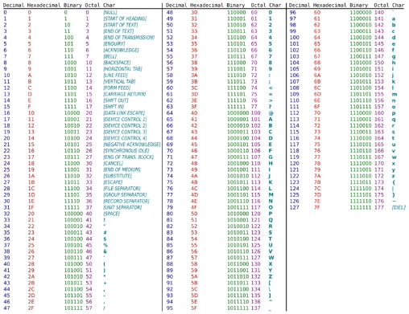
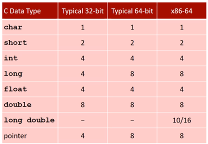
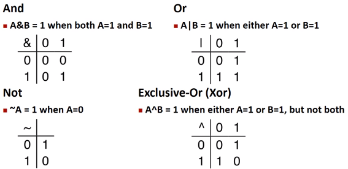
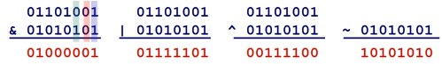

# CS 33 Lecture 1: Bits and Bytes

## Representing Information as Bits

### Everything is bits

- A bit itself is simply a value store that is either 0 or 1
- Computers use bits for storage/representing data structures
  - Storing instructions
  - and storing data, such as common types (strings, numbers, etc)
- Bits are chosen because they are easy to physically implement
  - Represented by "bistable elements"
  - Resistant to noise, as only two acceptable states
  - 0 or 1 represented by low or high voltage, respectively

### Counting in binary

- Base 10 Numbers
  - Digits are $[0, 9]$
  - We have a 10s place, 100s place, etc.
- Base 2 Number representation
  - Encoding numbers using bits
  - Our digits are only $[0, 1]$
  - We have a 2s place, 4s place, etc.
- We denote the base chosen using a subscript.
- For example,
  - $8_{10}$ = $1000_{2}$

### Encoding Byte Values

- A convenient format to store base 2 numbers is the byte
- A byte stores 8 bits:
  - Binary $00000000_{2}$ to $11111111_{2}$
  - Decimal $0_{10}$ to $255_{10}$
- We also have _Hexadecimal Representation_.
  - Base 16 numbers
  - Uses 0 through 9 _and_ A through F
  - A byte stores $00_{16}$ to FF$_{16}$
  - In a programming context, exadecimal numbers are prepended by `0x`. So, we write FA1D37B$_{16}$ as:
    - `0xFA1D37B`
    - `0xfa1d37b`
  - Hex is **super** convenient for represnting bytes because an entire byte is represented by two characters.

### Hex as a Convenient Way to Look at Bits

<p align="center"></p>

- Above is a stack diagram. The left column of hex numerals represents a memory address. The address is the start of 16 bytes of storage.
- These the address of each of the bytes can be found by replacing the last digit of the address with the byte index. This is in hex, so the index are [0, F], or [0, 15] in decimal notation.
- The indexes of each byte is shown in red starting at the address `0x00a0`
- Each collection of two digits/characters is an entire byte.

### More Applications of Bits

<p align="center"></p>

- ASCII Tables link characters to numbers. These numbers can of course be represented in hex, dec, or bin!

- Basic C types are all represented with bits, so context is important:

<p align="center"></p>

> **Note**:
> 32-bit and 64-bit are 4 and 8 bytes respectively. This affects the bit size of the data type, and also means we have to take more bytes into account when reading a memory dump.

## Bit-level manipulations

### Boolean Algebra

- George boole came up with it in the 1800s
- Lets us manipulate "true" and "false" data. ie, representing logic using mathematical rules.
  - A "boolean" is a device that is "true" or "false", encoded by a bit being 1 or zero, respectively
- The operators used are as below:

<p align="center"></p>

> **Note**
> The above operators are often referred to as bitwise operators.

- Examples of boolean algebra:
  ```c++
  bool a = true;
  bool b = false;
  a & b // false
  a | b // true
  ~a // false
  a^b // true
  ```

### General Boolean Algebras

<p align="center"></p>

- For boolean "vectors", ie a list of booleans, operators are added bitwise.
- The truth tables still hold for each corresponding pair of booleans

### Example: Representing & Manipulating Sets

- We can represent a width $w$ boolean vector as a subset of $\{ 0, \cdots, w - 1\}$
- For element number $j$ in above vector, element $a_j = 1$ if $j \in A$
- For example:
  - Given set $A = \{ 0, 3, 5, 6 \}$
  - And $w = 8$
  - We have:
    - $a = $ `01101001`
    - As can be seen, from right to left, the 0th, 3rd, 5th and 6th booleans are true in vector $a$.
- Another example:
  - Given set $B = \{ 0, 2, 4, 6 \}$
  - And $w = 8$
  - We have:
    - $b = $ `01010101`
    - As can be seen, from right to left, the 0th, 2nd, 4th and 6th booleans are true in vector $b$.
- The bitwise operators on these vectors may also be conveniently conceptualized using set operators.
- These are as follows:
  <!-- prettier-ignore -->
  | Operator | Operation            | Resulting Vector | Resulting Set       |
  |----------|----------------------|------------------|---------------------|
  | `A & B`  | Intersection         | `01000001`       | $\{ 0, 6 \}$        |
  | `A | B`  | Union                | `01111101`       | $\{ 0,2,3,4,5,6 \}$ |
  | `A ^ B`  | Symmetric difference | `01111101`       | $\{ 2,3,4,5 \}$     |
  | `~b`     | Complement           | `10101010`       | $\{ 1,3,5,7 \}$     |

- Any ctype can use bit level operators on its underlying bits
- These are applied bit-wise, with the object/variable being treated as a vector.
- Examples of these operations on a "char" which is stored in a singly byte:
  - `~0x41` $\rightarrow$ `0xBE`
    - `01000001` $\rightarrow$ `10111110`
  - `~0x00` $\rightarrow$ `0xFF`
    - `01000001` $\rightarrow$ `10111110`
  - `0x69 & 0x55` $\rightarrow$ `0x41`
    - `01101001 & 01010101` $\rightarrow$ `01000001`
  - `0x69 | 0x55` $\rightarrow$ `0x7D`
    - `01101001 | 01010101` $\rightarrow$ `01111101`

### Contrast: Logic Operations in C

- Contrast to Logical Operators
  - Logical operators are: `&&`, `||`, `!`
    - Only `0x00` is "False"
    - Anything else is "True"
    - Always returns a single bit (boolean)
    - Early termination for operators that can asume a result based on the first quantity
      - For example, `&&` will terminate with `false` early if the left operand resolves to `false`.
  - Examples of logical operators with ctypes:
    - `!0x41` $\rightarrow$ `0x00`
    - `!0x00` $\rightarrow$ `0x01`
    - `!!0x41` $\rightarrow$ `0x01`
  - `p && *p` avoids `nullptr` access, as it will terminate early when `p` is null, or 0x00.

### Shift Operations

- Left Shift: `x << y`
  - Shifts bits in `x` to the left `y` times.
    - Extra bits to the left will be discarded
    - New bits to the right will start as zeros
- Right Shift: `x >> y`
  - Shift bits in `x` to the right `y` times
    - Extra bits to the right will be discarded
    - New bits to the left will start as zeros
    - Arithmetic shift
      - New bits to the left will start as leftmost significant bit
    - Logical shift
      - New bits to the left will start as zeros
- Undefined Behavior when shift amount `< 0` or `>= sizeof(x)`.
- Example of arithmetic vs logical:
    <!-- prettier-ignore -->
  
  | Argument `x`      | `10100010` |
  | ----------------- | ---------- |
  | `<< 3`            | `00010000` |
  | Logical `>> 2`    | `00101000` |
  | Arithmetic `>> 2` | `11101000` |
  > **Note**
  > Notice how arithmetic right shift replaces the prepended bits with `1` as it is the first bit in the original bit-vector `x`

