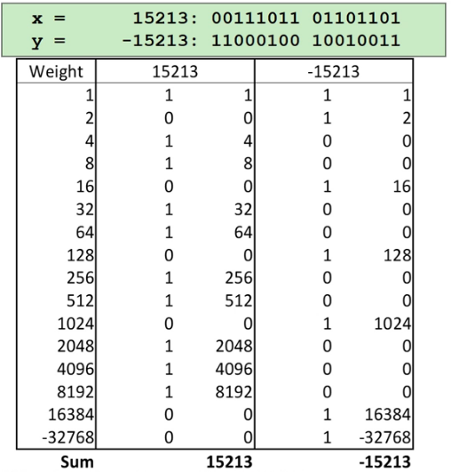
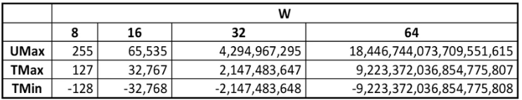

# CS 33 Lecture 2: Integers

Dated: 03/31/2021

## Encoding Integers

There are two types of encoding:

1. Unsigned:
   $$
   B2U(X) = \sum_{i=0}^{w-1}{x_{i}\cdot2^i}
   $$

   - Here, $w$ is the "width" of the number in bits
   - $x_i$ is the $i$'th digit of the binary number

2. Two's complement:
   $$
   B2T(X) = -x_{w-1}\cdot2^{w-1}+\sum_{i=0}^{w-2}{x_i\cdot2^i}
   $$

   - Here, $-x_{w-1}$ is the "sign bit" of the binary number

   - Encoding table:

     

     - `15213` is the sum of the weighted components of the bit elements
     - As can be seen, for `-15213` we start very negative, and use the summation of the rest of the bits to bring us to the actual number

## Numeric Ranges

### Unsigned Values:

- $\text{UMin} = 0$

  $000...0$

- $UMax = 2^w-1$

  $111...1$

### Two's Complement Values:

- $TMin = -2^{w-1}$

  $100...0$

- $TMax = 2^{w-1} - 1$

  $011...1$

### Other Values:

- $-1 = 111...1$

### Values for $W = 16$

|        | Decimal | Hex     | Binary              |
| ------ | ------- | ------- | ------------------- |
| `Umax` | 65535   | `FF FF` | `11111111 11111111` |
| `TMax` | 32767   | `7F FF` | `01111111 11111111` |
| `TMin` | -32768  | `80 00` | `10000000 00000000` |
| -1     | -1      | `FF FF` | `11111111 11111111` |
| 0      | 0       | `00 00` | `00000000 00000000` |

### Values for Different Word Sizes



#### Important observations:

- $|\text{TMin}| = \text{TMax} + 1$
  - Asymmetric range
- $\text{UMax} = 2*\text{TMax} + 1$

#### C Programming

```c
#include <limits.h>

ULONG_MAX; // UMax
LONG_MAX; // TMax
LONG_MIN; // TMin
```

All values are platform-specific

