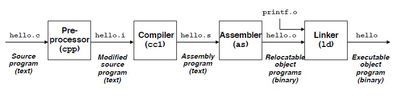

# CS 33: Lecture 1 (3/29)

## Class Policies

### Style

- Discussions are required
- Lectures cover high level concepts
- Labs are the "heart" of the course, ie the biggest learning experience
- Class webpage hosted on CCLE
- Grading:
  - Exams (50%)
  - Labs (35%)
  - Discussion Attendance (10%)
  - Homework (5%)

### Upcoming Assignments

- Labs:
  - Warmup lab
  - Data lab
  - Bomb lab
  - Attack lab
  - Parallel lab

## Back to CS

### The Compilation System

<p align="center"></p>

### Some demos:

```c
char charbq;
char stringy[8];
int integrr;
char byteme;
char bitarray

charbq = 0x75; // 't'
strcpy(stringy, "abcdefg");
integrr = 42;
byteme = 0b01101111; // 0b pretexts binary, 0x6F
bitarray = 0b01010101; // 0x55
```

Output:

| Name         | Output     |
| ------------ | ---------- |
| `stringy`    | `abcdefg`  |
| `charbq`     | `t`        |
| `integrr`    | `42`       |
| `byteme`     | `01101111` |
| `bitarray`   | `01010101` |
| AND          | `01000101` |
| OR           | `01111111` |
| XOR          | `00111010` |
| NOT `byteme` | `10010000` |

### GDB - GNU Debugger

GDB is the standard debugger for C/C++ compiled using GCC. We can setup break 

