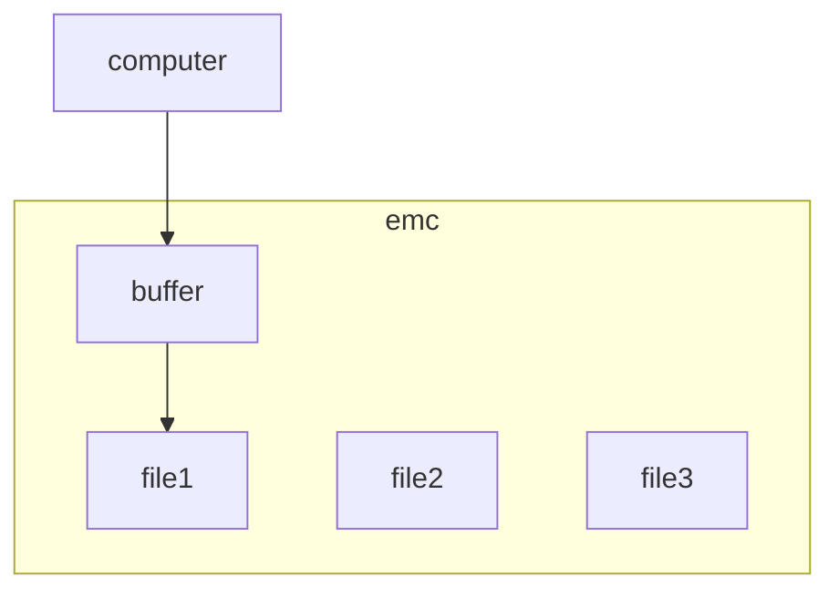
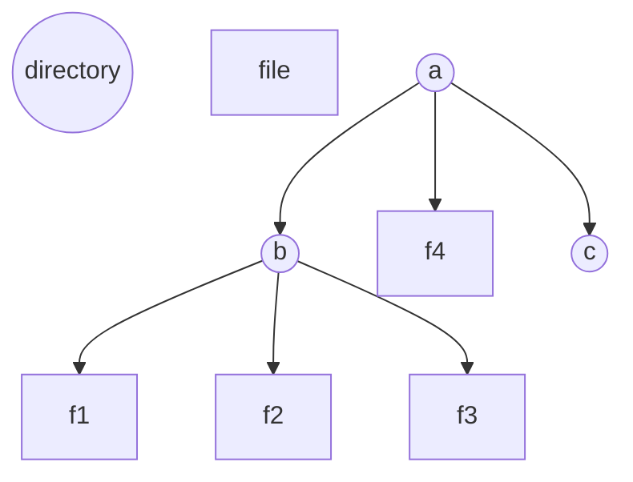

## UCLA CS 35L Lecture 03/30/2021

### Software Construction

#### Ideal Case: change the world via software

- example: app for checking status of COVID-19 inoculation
- how can I check other people's status?
  - privacy issues, financial issues (not a subject of this course)
  - still a lot of technical issues

#### What we will do in this class

Many ways to build such an app. How to decide which way to do it? Learn it on the street:

- Ask a friend
- Hire programmers
- we want a better way!

Or: Take CS31, 32, 131, 130, ...

- Standard CS curriculum, general principles of coding, programming languages, etc.

So, we find a compromise:

- General patterns of software construction, hook into SWE, OS, PL classes
- Case studies of real software ecosystems: learn by doing / stuff that's not in the lecture
  - Filesystems (CS 111 intro) from the user's viewpoint
  - Scripting ("quick & dirty programming") (`sh`, Emacs Lisp, Python)
  - Version control (git)
  - low-level debugging (one level up from machine code, using C, GDB, Valgrind)
    - Looking at it from the source code perspective
  - Client-server compute (web client + web server, JavaScript, Node.js, React)

The ages of classic software ecosystems differ.

* "classic" - `sh`, Emacs Lisp
* "modern" - Node.js, React
* The classic tools are showing signs of age in the form of limitations
* The modern tools may not be around for as long

#### General Principles we will cover

- Programming
- Data structure design
- Integration (gluing together various software components)
  - A goal is to make the "glue" as simple and straightforward as possible
  - The components must also be as simple and general as possible
- Configuration:
  - Example: `cat`:
    - `cat --help` tells us the configuration options
- Testing (very time consuming, can take more than 50% of the effort)
- Versioning (software mutates over time)
- Security (defending against attacks)
- Forensics (figuring out what went wrong after an attack)

#### Emacs :roll_eyes:

- `M-x shell` opens terminal
- `M-x` enters command mode
- `C-x b` to switch buffers
- Buffers:

#### Advice

- Lecture is more like 3.4 hrs, labs likely 1.5 hrs, outside study probably 7+ hrs.
- The goal of the class is to "front-load"

- Exams will be on:
  - Lecture contents
  - Homework assignments
- **Use lnxsrv11 through lnxsrv15 that are configured for CS35L software testing. They are running RHEL 8.**
- Make sure `$PATH` includes `/usr/local/cs/bin`.

#### File Structure

- Directory containing "a" is the root directory, simply denoted by `/`
- So, the path to `f1` is `/a/b/f1`.
- `ls` is the common tool to see the contents of a directory:
  - `ls -l` shows file metadata

