## Physics 1C Lecture 1

As of 03/29/2021.

### "E&M" (electromagnetism)

```mermaid
graph LR
    charge --> field[electric fields];
    field --> c[Coulomb's Law]:::law;
    field --> g[Gauss' Law]:::law;
    mov[moving charge] --> mfield[magnetic fields];
    mfield --> a[Ampere's]:::law
	classDef law fill:#333,stroke:#f9f,stroke-width:4px
```

Gauss:
$$
\oint_\text{surface} {E \cdot dA = \frac{1}{{\varepsilon _0 }}} Q_{\text{inside}}
$$
Ampere:
$$
\oint_\text{loop} {B \cdot d\ell} = \mu_0I
$$

---

4 laws $\rightarrow$ Electromagnetic waves (radio waves, visible light, infrared, UV

Speed of light:
$$
\begin{align}
c &= \frac{1}{\sqrt{\varepsilon_0\mu_0}}
&=3\times10^8 m/s
\end{align}
$$

---

Light + matter: reflection, refraction $\rightarrow$ prims, lens, mirrors $\rightarrow$ Optics

---

Einstein 1905: take laws of E&M as fundamental:

- Space and time depend on the observer
- Energy + momentum are separate
- $E=mc^2$ $\leftarrow$ incomplete

> **Note**
>
> If you are travelling at velocity $v$ and holding a light, the speed of the light is still $c$ *not* $v+c$.

