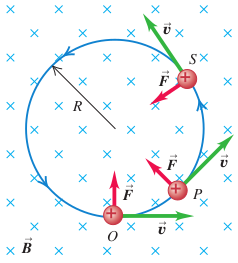
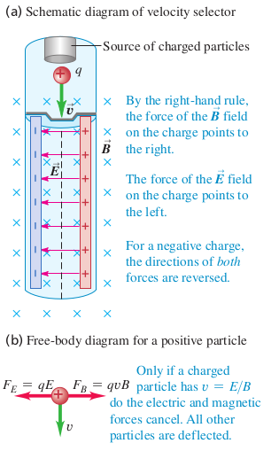
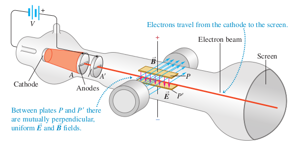
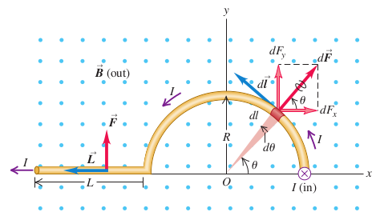

# Chapter 27 Notes

## 27.1:  Magnetism

- Magnets are always bipolar
- Poles of magnet are referred to as "north" and "south". 

## 27.2: Magnetic Field

Electric interactions are represented in two steps:

1. A distribution of electric charge that creates electric field $\vec{E}$ in the surrounding space.
2. The electric field exerts force $\vec{F} = q \vec{E}$

Magnetic interactions may be described similarly:

1. A moving charge creates a magnetic field $\vec{B}$ in the surrounding space in addition to its electric field
2. The magnetic field exerts a force $\vec{B}$ . 

Conventions:

- Magnetic field denoted by $\vec{B}$
- $\vec{B}$ goes out of the north pole and into the south pole:

### Magnetic Forces on Moving Charges

The magnitude of the force is directly proportional to charge, field strength, and velocity of the charge:
$$
F = |q|v_{\perp}B = |q|vB\sin\phi
$$
Where:

- $q = $ charge
- $v = $ velocity
- $B$ = field magnitude

The force vector is given by:
$$
\vec{F} = q\vec{v}\times\vec{B}
$$
Here:

- $\vec{F} :=$  Magnetic force on a moving charged particle
- $q:=$  Particle's charge
- $\vec{v} :=$ particle's velocity
- $\vec{B}:=$ Magnetic field

We use the right hand rule for cross product computation, and for visualization of the ending direction.

Units of field:
$$
1 \text{ tesla} = 1 \text{ T} = 1\text{ N}/\text{A}\cdot\text{m}\\
1 \text{ G} = 10^{-4} \text{ T}
$$
### Measuring Magnetic Fields with Test Charges

Magnetic fields can be measured indirectly using test charges moved at a certain velocity. Given that we can can measure the force on, charge, and velocity of the particle, we can calculate the field using equation 1. 

The net electromagnetic force equation must often be used for this if there are both electric and magnetic fields in the system beyond that of the test charge:
$$
\vec{F} = q(\vec{E} + \vec{v} \times \vec{B})
$$
If there is no force perpendicular to the velocity, there *must* be no magnetic field.

## 27.3: Magnetic Field Lines and Magnetic Flux

Any magnetic field may be represented by magnetic field lines. it is important to note that the magnetic field lines drawn are *not* parallel to the line of force. Rather, the force direction is dependent on *both* velocity and magnetic field, as given by equation 2. 

### Magnetic Flux and Gauss' Law for Magnetism

We can apply Gauss' law for magnetic flux in precisely the same way that we do for electric flux:
$$
\Phi_{B}=\int B \cos \phi \space dA = \int \vec{B} \cdot d\vec{A}
$$
Here, $\vec{B} \cdot d\vec{A}$ is the same as saying perpendicular component $\vec{B}$ to a differentially small planar surface area $dA$ of a gaussian surface. We may write this as a sum of all the: $\vec{B}_{\perp}dA$. If $\vec{B}$ is uniform across a planar surface with total area $A$, then we may write this as:
$$
\Phi_{B} = B_{\perp}A = BA\cos \phi
$$
With the understanding that monopoles are empirically impossible for magnetic fields, we arrive at:
$$
\oint \vec{B}\cdot d\vec{A} = 0
$$
For any closed surface placed in any magnetic field. This is visually apparent, as every field line entering a closed surface, must also exit it. For open surfaces, it is convenient to take a differential form of Gauss' law:
$$
B = \frac{d\Phi_B}{dA_{\perp}}
$$
In other words, the magnitude of the field is the same as flux per unit area. For this reason, we may refer to magnetic field as magnetic flux density.

## Motion of Charged Particles in a Magnetic Field

The perpendicular direction of magnetic force demands that recall concepts regarding centripetal acceleration:
$$
F = |q|vB = m\frac{v^2}{R}
$$
For mass $m$, speed $v$, and radius of circular motion $R$. Solving for $R$:
$$
R=\frac{mv}{|q|B}
$$
It is important to note that these are all *magnitudes*. One must find direction by considering the sign of $q$. Using the simple formula $v=R\omega$, we have the following formula for angular speed of a charged particle moving through a magnetic field:
$$
\omega=\frac{v}{R}=v\frac{|q|B}{mv}=\frac{|q|B}{m}
$$
Recalling SHM definitions, the rotational frequency is given by: $f=\omega/2\pi$. This is known as the *cyclotron frequency*. As can be seen from the formula for $\omega$, this is independent of the path radius.

> In the above figure, we have field into page, positive charge, and a centripetal force. The motion is counter clockwise because the charge is *positive*. If the charge was negative, the motion would be clockwise. We can calculate the magnitude of the radius $R$ using the other quantities in the image. Thus, before the charged particle has a chance to enter centripetal motion, we know the radius it will take.

## 27.5: Applications of Motion of Charged Particles

### Velocity Selector:

Given the constraint $qE = qvB$ Only particles at:
$$
v = \frac{E}{B}
$$
will pass through this selector.

### Thomson's $e/m$ experiment

This experiment is designed to measure the charge mass ratio of an electron. This can be done using the energy relationship of a single electron, that without external work:
$$
\frac{1}{2}mv^2=eV \qquad\text{or}\qquad v= \sqrt{\frac{2eV}{m}}
$$
The electrons that can pass through the plates $P$ and $P'$ strike the screen at the end of the tube. The electrons have a perfectly horizontal path when equation 12 is satisfied. Combining this with equation 13, we arrive at:
$$
\frac{E}{B} = \sqrt{\frac{2eV}{m}}\qquad\text{so}\qquad\frac{e}{m}=\frac{E^2}{2VB^2}
$$

## 27.6: Magnetic Force on a Current-Carrying Conductor

We can use equation 1 to compute force due to a single charge. Using the relationship: $qv=I\ell$, we arrive at:
$$
F = I\ell B
$$
For $B$ perpendicular to the wire. We may retain our logic for point charges for askew $B$:
$$
F = I\ell B_{\perp} = I\ell B \sin \phi
$$
Finally, it becomes apparent that:
$$
\vec{F} = I\vec{\ell}\times\vec{B} \\
\text{or} \\
d\vec{F} = I\space d\vec{\ell}\times\vec{B} \\
$$
Here, $\ell$ is a vector length of the segment of wire. This vector must point in the direction of current $I$, as it makes up for a lack of direction on the actual current number. We may take a line integral to find the total force on a wire that is not straight:

#### Example Problem #1

Let us denote the first straight segment as segment 1, and the semicircular segment as segment 2.

For segment 1:
$$
\vec{L} = -L\hat{i}\\
\vec{F}_1 = I\vec{L}\times \vec{B} = ILB\hat{j}
$$
For segment 2:
$$
\begin{align}
d\ell &= R\:d\theta\\
dF_2 &= I\:d\ell\:B\\
&= I(R\: d\theta)B
\end{align}
$$
Looking at equation 21, we see that $dF_2$ can be broken into an $x$ and $y$ component:
$$
dF_{2x} = IR\:d\theta\:B\cos\theta \qquad dF_{2y} = IR\:d\theta\:B\sin\theta\\
$$
Using these differentials, we may now integrate to find $F_{2x}$ and $F_{2y}$:
$$
\begin{align}
F_{2x} &= IRB\int_{0}^{\pi}\cos\theta\:d\theta=0\\
F_{2y} &= IRB\int_{0}^{\pi}\sin\theta\:d\theta=2IRB
\end{align}
$$
Thus, we have: $\vec{F}_2 = 2IRB\hat{j}$. Adding segment 1 and 2 together gives:
$$
\vec{F} = \vec{F}_1+\vec{F}_2= ILB\hat{j} + 2IRB\hat{j} = IB(L + 2R)\hat{j}
$$
